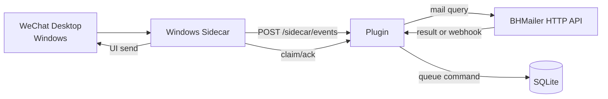

# Runtime flow diagram

```mermaid
flowchart LR
  WX[WeChat Desktop\nWindows] --> SC[Windows Sidecar]
  SC -->|POST /sidecar/events| PL[Plugin]
  PL -->|mail query| MH[BHMailer HTTP API]
  MH -->|result or webhook| PL
  PL -->|queue command| DB[(SQLite)]
  SC -->|claim/ack| PL
  SC -->|UI send| WX
```

